# 🏦 ms-hex-credit-card-gt

> **Microservicio de Tarjetas de Crédito**  
> Arquitectura: **Hexagonal (Ports & Adapters) + Domain-Driven Design (DDD)**  
> Stack: **Java · Spring Boot · SQL Server · Azure Cosmos DB · MongoDB**

---

## 📋 Tabla de Contenidos

1. [Arquitectura Detectada](#️-arquitectura-detectada)
2. [Vista General](#️-vista-general--flujo-arquitectónico)
3. [Capa Web — REST Inbound Adapter](#-capa-web--rest-inbound-adapter)
4. [AOP — Cross-cutting Concerns](#-aop--cross-cutting-concerns)
5. [Input Ports — Puertos de Entrada](#-input-ports--puertos-de-entrada)
6. [Application Services — Use Cases & Business Services](#️-application-services--use-cases--business-services)
7. [Output Ports — Puertos de Salida](#-output-ports--puertos-de-salida)
8. [Domain Model — DDD](#-domain-model--ddd)
9. [SQL Server Adapters — Outbound](#️-sql-server-adapters--outbound)
10. [NoSQL Adapters — Cosmos DB & MongoDB](#-nosql-adapters--outbound)
11. [WS Adapter & ID Generator — Outbound](#-ws-adapter--id-generator--outbound)
12. [Spring Configuration](#️-spring-configuration)
13. [Jerarquía de Excepciones](#-jerarquía-de-excepciones)
14. [Relaciones Clave — Flujo Completo](#-relaciones-clave--flujo-completo)

---

## 🏛️ Arquitectura Detectada

**Hexagonal Architecture (Ports & Adapters) + Domain-Driven Design (DDD)**

| Capa | Paquete | Descripción |
|------|---------|-------------|
| 🌐 Inbound Adapter REST | `infraestructure.web` | OpenAPI Controllers + Delegates + Mappers |
| 📥 Input Ports | `application.port.in` | Interfaces Use Cases + Queries + Commands + Views |
| ⚙️ Application Services | `application.service` | Implementaciones de Use Cases y Queries |
| 🔧 Business Services | `application.service.usecase.business` | Coordinadores de dominio hacia Output Ports |
| 📤 Output Ports | `application.port.out` | Interfaces repositorios, WS y generadores |
| 🎯 Domain | `domain` | Entidades, Aggregates, Value Objects, Factories, Exceptions |
| 🗄️ SQL Outbound Adapter | `infraestructure.persistence.db.sql` | SQL Server vía JPA/Hibernate |
| 🗃️ NoSQL Outbound Adapter | `infraestructure.persistence.db.nosql` | Azure Cosmos DB + MongoDB |
| 🌍 WS Outbound Adapter | `infraestructure.ws` | REST Client tipo de cambio externo |
| ⚡ ID Generator Adapter | `infraestructure.generator` | Snowflake ID distribuido |
| 🔄 AOP | `infraestructure.aop` | Transacciones declarativas con Aspect |
| ⚙️ Configuration | `infraestructure.config` | Wiring manual Spring (sin `@Service` en application) |

---

## 🗺️ Vista General — Flujo Arquitectónico

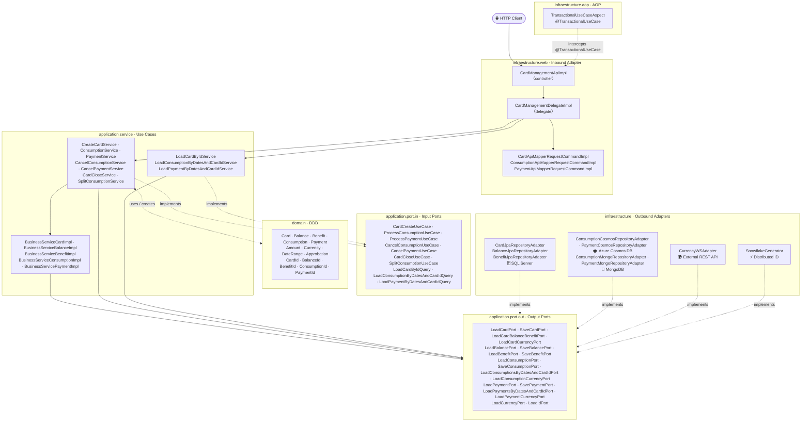

---

## 🌐 Capa Web — REST Inbound Adapter

### Schemas de Request

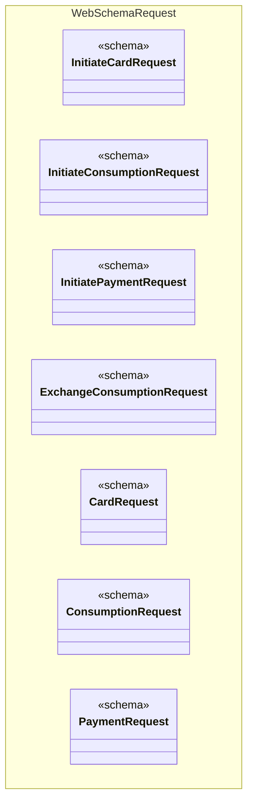

### Schemas de Response

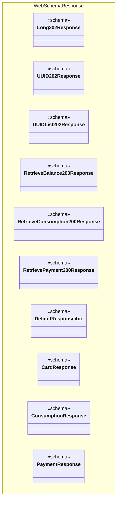

### Controller, Delegate y Mappers de Comando

```mermaid
classDiagram
    class CardManagementApi {
        <<interface>>
        +initiateCard(req, br) ResponseEntity
        +initiateConsumption(cardId, req, br) ResponseEntity
        +initiatePayment(cardId, req, br) ResponseEntity
        +exchangeConsumption(cardId, cId, req, br) ResponseEntity
        +controlCard(cardId) ResponseEntity
        +controlConsumption(cardId, cId) ResponseEntity
        +controlPayment(cardId, pId) ResponseEntity
        +retrieveBalance(cardId) ResponseEntity
        +retrieveConsumption(cardId, start, end) ResponseEntity
        +retrievePayment(cardId, start, end) ResponseEntity
    }

    class CardManagementApiImpl {
        <<controller>>
        -cardManagementDelegate CardManagementDelegate
        +initiateCard(req, br) ResponseEntity~Long202Response~
        +initiateConsumption(cardId, req, br) ResponseEntity~UUID202Response~
        +initiatePayment(cardId, req, br) ResponseEntity~UUID202Response~
        +exchangeConsumption(cardId, cId, req, br) ResponseEntity~UUIDList202Response~
        +controlCard(cardId) ResponseEntity~Long202Response~
        +controlConsumption(cardId, cId) ResponseEntity~UUID202Response~
        +controlPayment(cardId, pId) ResponseEntity~UUID202Response~
        +retrieveBalance(cardId) ResponseEntity~RetrieveBalance200Response~
        +retrieveConsumption(cardId, s, e) ResponseEntity~RetrieveConsumption200Response~
        +retrievePayment(cardId, s, e) ResponseEntity~RetrievePayment200Response~
    }

    class CardManagementDelegate {
        <<interface>>
        +initiateCard(req, br) ResponseEntity
        +initiateConsumption(cardId, req, br) ResponseEntity
        +initiatePayment(cardId, req, br) ResponseEntity
        +exchangeConsumption(cardId, cId, req, br) ResponseEntity
        +controlCard(cardId) ResponseEntity
        +controlConsumption(cardId, cId) ResponseEntity
        +controlPayment(cardId, pId) ResponseEntity
        +retrieveBalance(cardId) ResponseEntity
        +retrieveConsumption(cardId, s, e) ResponseEntity
        +retrievePayment(cardId, s, e) ResponseEntity
    }

    class CardManagementDelegateImpl {
        <<delegate>>
        -createCardService CreateCardService
        -cardCancelPaymentService CancelPaymentService
        -cardCancelConsumptionService CancelConsumptionService
        -cardCloseService CardCloseService
        -cardConsumptionService ConsumptionService
        -cardPaymentService PaymentService
        -splitConsumptionService SplitConsumptionService
        -loadCardByIdService LoadCardByIdService
        -loadConsumptionByDatesAndCardIdService LoadConsumptionByDatesAndCardIdService
        -loadPaymentByDatesAndCardIdService LoadPaymentByDatesAndCardIdService
        -cardApiMapperRequestCommand CardApiMapperRequestCommand
        -consumptionApiMapperRequestCommand ConsumptionApiMapperRequestCommand
        -paymentApiMapperRequestCommand PaymentApiMapperRequestCommand
    }

    class CardApiMapperRequestCommand {
        <<interface>>
        +toCommand(data) CardCreateCommand
        +toCommandId(cardId) CardCloseCommand
        +toResponse(view) CardResponse
    }
    class CardApiMapperRequestCommandImpl {
        <<adapter>>
    }

    class ConsumptionApiMapperRequestCommand {
        <<interface>>
        +toCommand(data, cardId) CardProcessConsumptionCommand
        +toCommandId(consumptionId, cardId) CardCancelConsumptionCommand
        +toCommandIdR(cId, cardId, data) CardSplitConsumptionCommand
        +toResponse(view) ConsumptionResponse
    }
    class ConsumptionApiMapperRequestCommandImpl {
        <<adapter>>
    }

    class PaymentApiMapperRequestCommand {
        <<interface>>
        +toCommand(data, cardId) CardProcessPaymentCommand
        +toCommandId(paymentId, cardId) CardCancelPaymentCommand
        +toResponse(view) PaymentResponse
    }
    class PaymentApiMapperRequestCommandImpl {
        <<adapter>>
    }

    class GlobalControllAdvice {
        <<exception-handler>>
        +handleMethodArgumentNotValid(ex, req) ResponseEntity
        +handleConstraintViolation(ex, req) ResponseEntity
        +handleRequestValidationException(ex, req) ResponseEntity
        +handleCustomPersistenceException(ex, req) ResponseEntity
        +handleDomainException(ex, req) ResponseEntity
        +handleApplicationException(ex, req) ResponseEntity
        +handleConverterWSClientException(ex, req) ResponseEntity
        +handleGenericException(ex, req) ResponseEntity
    }

    CardManagementApiImpl ..|> CardManagementApi
    CardManagementApiImpl --> CardManagementDelegate : delegates to
    CardManagementDelegateImpl ..|> CardManagementDelegate
    CardManagementDelegateImpl --> CardApiMapperRequestCommand
    CardManagementDelegateImpl --> ConsumptionApiMapperRequestCommand
    CardManagementDelegateImpl --> PaymentApiMapperRequestCommand
    CardApiMapperRequestCommandImpl ..|> CardApiMapperRequestCommand
    ConsumptionApiMapperRequestCommandImpl ..|> ConsumptionApiMapperRequestCommand
    PaymentApiMapperRequestCommandImpl ..|> PaymentApiMapperRequestCommand
```

---

## 🔄 AOP — Cross-cutting Concerns

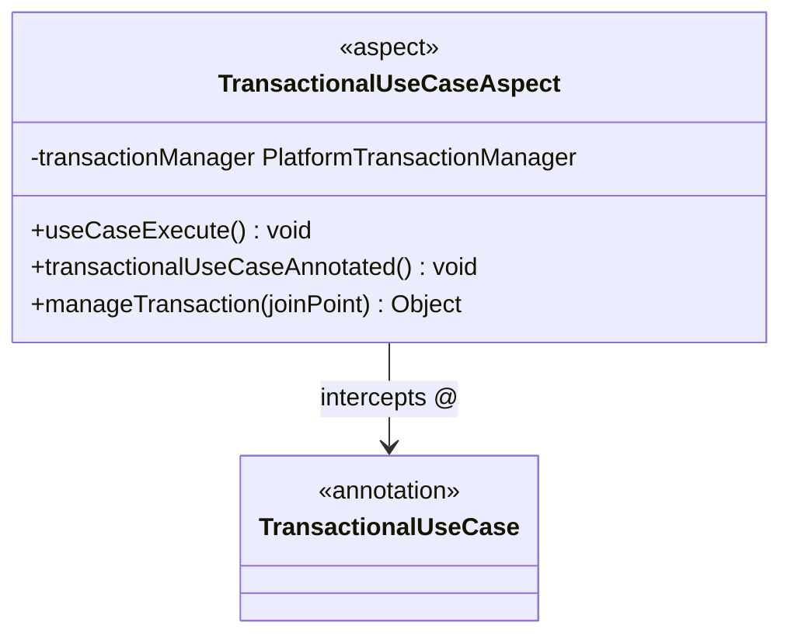

---

## 📥 Input Ports — Puertos de Entrada

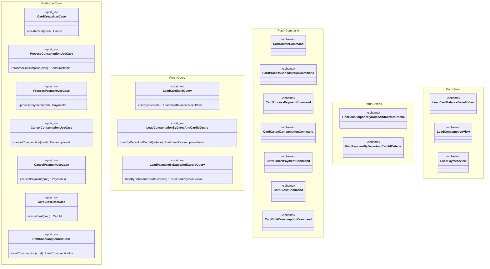

---

## ⚙️ Application Services — Use Cases & Business Services

### Use Cases y Query Services

```mermaid
classDiagram
    class CreateCardService {
        <<usecase>>
        -businessServiceCard BusinessServiceCard
        -businessServiceBalance BusinessServiceBalance
        -businessServiceBenefit BusinessServiceBenefit
        -loadIdPort LoadIdPort
        -loadCurrencyPort LoadCurrencyPort
        -balanceFactory BalanceFactory
        +createCard(cmd) CardId
    }
    class ConsumptionService {
        <<usecase>>
        -businessServiceCard BusinessServiceCard
        -businessServiceBalance BusinessServiceBalance
        -businessServiceBenefit BusinessServiceBenefit
        -businessServiceConsumption BusinessServiceConsumption
        -loadCurrencyPort LoadCurrencyPort
        +processConsumption(cmd) ConsumptionId
    }
    class PaymentService {
        <<usecase>>
        -businessServiceCard BusinessServiceCard
        -businessServiceBalance BusinessServiceBalance
        -businessServiceBenefit BusinessServiceBenefit
        -businessServicePayment BusinessServicePayment
        -loadCurrencyPort LoadCurrencyPort
        -paymentFactory PaymentFactory
        +processPayment(cmd) PaymentId
    }
    class CancelConsumptionService {
        <<usecase>>
        -businessServiceCard BusinessServiceCard
        -businessServiceBalance BusinessServiceBalance
        -businessServiceConsumption BusinessServiceConsumption
        +cancelConsumption(cmd) ConsumptionId
    }
    class CancelPaymentService {
        <<usecase>>
        -businessServiceCard BusinessServiceCard
        -businessServiceBalance BusinessServiceBalance
        -businessServicePayment BusinessServicePayment
        +cancelPayment(cmd) PaymentId
    }
    class CardCloseService {
        <<usecase>>
        -businessServiceCard BusinessServiceCard
        -businessServiceBalance BusinessServiceBalance
        -businessServiceBenefit BusinessServiceBenefit
        +closeCard(cmd) CardId
    }
    class SplitConsumptionService {
        <<usecase>>
        -businessServiceCard BusinessServiceCard
        -businessServiceBalance BusinessServiceBalance
        -businessServiceConsumption BusinessServiceConsumption
        +splitConsumption(cmd) List~ConsumptionId~
    }
    class LoadCardByIdService {
        <<query>>
        -loadCardBalanceBenefitPort LoadCardBalanceBenefitPort
        +findById(cardId) LoadCardBalanceBenefitView
    }
    class LoadConsumptionByDatesAndCardIdService {
        <<query>>
        -loadConsumptionsByDatesAndCardIdPort LoadConsumptionsByDatesAndCardIdPort
        +findByDatesAndCardId(criteria) List~LoadConsumptionView~
    }
    class LoadPaymentByDatesAndCardIdService {
        <<query>>
        -loadPaymentsByDatesAndCardIdPort LoadPaymentsByDatesAndCardIdPort
        +findByDatesAndCardId(criteria) List~LoadPaymentView~
    }

    class CardCreateUseCase { <<port_in>> }
    class ProcessConsumptionUseCase { <<port_in>> }
    class ProcessPaymentUseCase { <<port_in>> }
    class CancelConsumptionUseCase { <<port_in>> }
    class CancelPaymentUseCase { <<port_in>> }
    class CardCloseUseCase { <<port_in>> }
    class SplitConsumptionUseCase { <<port_in>> }
    class LoadCardByIdQuery { <<port_in>> }
    class LoadConsumptionByDatesAndCardIdQuery { <<port_in>> }
    class LoadPaymentByDatesAndCardIdQuery { <<port_in>> }

    CreateCardService ..|> CardCreateUseCase
    ConsumptionService ..|> ProcessConsumptionUseCase
    PaymentService ..|> ProcessPaymentUseCase
    CancelConsumptionService ..|> CancelConsumptionUseCase
    CancelPaymentService ..|> CancelPaymentUseCase
    CardCloseService ..|> CardCloseUseCase
    SplitConsumptionService ..|> SplitConsumptionUseCase
    LoadCardByIdService ..|> LoadCardByIdQuery
    LoadConsumptionByDatesAndCardIdService ..|> LoadConsumptionByDatesAndCardIdQuery
    LoadPaymentByDatesAndCardIdService ..|> LoadPaymentByDatesAndCardIdQuery
```

### Business Services (Coordinadores de Dominio)

```mermaid
classDiagram
    class BusinessServiceCard {
        <<business>>
        +get(cardId) Card
        +save(card) CardId
    }
    class BusinessServiceCardImpl {
        <<business>>
        -loadCardPort LoadCardPort
        -saveCardPort SaveCardPort
        -loadCurrencyPort LoadCurrencyPort
        -loadCardCurrencyPort LoadCardCurrencyPort
    }
    class BusinessServiceBalance {
        <<business>>
        +get(cardId) Balance
        +save(balance) BalanceId
    }
    class BusinessServiceBalanceImpl {
        <<business>>
        -loadBalancePort LoadBalancePort
        -saveBalancePort SaveBalancePort
        -loadCurrencyPort LoadCurrencyPort
        -loadCardCurrencyPort LoadCardCurrencyPort
    }
    class BusinessServiceBenefit {
        <<business>>
        +get(cardId) Benefit
        +save(benefit) BenefitId
    }
    class BusinessServiceBenefitImpl {
        <<business>>
        -loadBenefitPort LoadBenefitPort
        -saveBenefitPort SaveBenefitPort
    }
    class BusinessServiceConsumption {
        <<business>>
        +get(cardId, consumptionId) Consumption
        +save(consumption) ConsumptionId
    }
    class BusinessServiceConsumptionImpl {
        <<business>>
        -loadConsumptionPort LoadConsumptionPort
        -saveConsumptionPort SaveConsumptionPort
        -loadConsumptionCurrencyPort LoadConsumptionCurrencyPort
        -loadCurrencyPort LoadCurrencyPort
    }
    class BusinessServicePayment {
        <<business>>
        +get(cardId, paymentId) Payment
        +save(payment) PaymentId
    }
    class BusinessServicePaymentImpl {
        <<business>>
        -loadPaymentPort LoadPaymentPort
        -savePaymentPort SavePaymentPort
        -loadPaymentCurrencyPort LoadPaymentCurrencyPort
        -loadCurrencyPort LoadCurrencyPort
    }

    BusinessServiceCardImpl ..|> BusinessServiceCard
    BusinessServiceBalanceImpl ..|> BusinessServiceBalance
    BusinessServiceBenefitImpl ..|> BusinessServiceBenefit
    BusinessServiceConsumptionImpl ..|> BusinessServiceConsumption
    BusinessServicePaymentImpl ..|> BusinessServicePayment
```

### Use Cases → Business Services (Dependencias)

```mermaid
classDiagram
    class CreateCardService { <<usecase>> }
    class ConsumptionService { <<usecase>> }
    class PaymentService { <<usecase>> }
    class CancelConsumptionService { <<usecase>> }
    class CancelPaymentService { <<usecase>> }
    class CardCloseService { <<usecase>> }
    class SplitConsumptionService { <<usecase>> }
    class BusinessServiceCard { <<business>> }
    class BusinessServiceBalance { <<business>> }
    class BusinessServiceBenefit { <<business>> }
    class BusinessServiceConsumption { <<business>> }
    class BusinessServicePayment { <<business>> }

    CreateCardService --> BusinessServiceCard
    CreateCardService --> BusinessServiceBalance
    CreateCardService --> BusinessServiceBenefit
    ConsumptionService --> BusinessServiceCard
    ConsumptionService --> BusinessServiceBalance
    ConsumptionService --> BusinessServiceBenefit
    ConsumptionService --> BusinessServiceConsumption
    PaymentService --> BusinessServiceCard
    PaymentService --> BusinessServiceBalance
    PaymentService --> BusinessServiceBenefit
    PaymentService --> BusinessServicePayment
    CancelConsumptionService --> BusinessServiceCard
    CancelConsumptionService --> BusinessServiceBalance
    CancelConsumptionService --> BusinessServiceConsumption
    CancelPaymentService --> BusinessServiceCard
    CancelPaymentService --> BusinessServiceBalance
    CancelPaymentService --> BusinessServicePayment
    CardCloseService --> BusinessServiceCard
    CardCloseService --> BusinessServiceBalance
    CardCloseService --> BusinessServiceBenefit
    SplitConsumptionService --> BusinessServiceCard
    SplitConsumptionService --> BusinessServiceBalance
    SplitConsumptionService --> BusinessServiceConsumption
```

### Excepciones de Aplicación

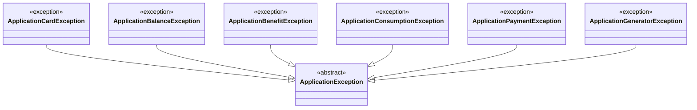

---

## 📤 Output Ports — Puertos de Salida

```mermaid
classDiagram
    namespace PortOutCard {
        class LoadCardPort {
            <<port_out>>
            +load(cardId, currency) Optional~Card~
        }
        class SaveCardPort {
            <<port_out>>
            +save(card) Optional~Long~
        }
        class LoadCardBalanceBenefitPort {
            <<port_out>>
            +loadAll(cardId) Optional~LoadCardBalanceBenefitView~
        }
        class LoadCardCurrencyPort {
            <<port_out>>
            +load(cardId) Optional~CurrencyEnum~
        }
    }
    namespace PortOutBalance {
        class LoadBalancePort {
            <<port_out>>
            +load(cardId, currency) Optional~Balance~
        }
        class SaveBalancePort {
            <<port_out>>
            +save(balance) Optional~Long~
        }
    }
    namespace PortOutBenefit {
        class LoadBenefitPort {
            <<port_out>>
            +load(cardId) Optional~Benefit~
        }
        class SaveBenefitPort {
            <<port_out>>
            +save(benefit) Optional~Long~
        }
    }
    namespace PortOutConsumption {
        class LoadConsumptionPort {
            <<port_out>>
            +load(consumptionId, cardId, currency) Optional~Consumption~
        }
        class SaveConsumptionPort {
            <<port_out>>
            +save(consumption) Optional~UUID~
        }
        class LoadConsumptionsByDatesAndCardIdPort {
            <<port_out>>
            +load(criteria) List~LoadConsumptionView~
        }
        class LoadConsumptionCurrencyPort {
            <<port_out>>
            +load(consumptionId, cardId) Optional~CurrencyEnum~
        }
    }
    namespace PortOutPayment {
        class LoadPaymentPort {
            <<port_out>>
            +load(paymentId, cardId, currency) Optional~Payment~
        }
        class SavePaymentPort {
            <<port_out>>
            +save(payment) Optional~UUID~
        }
        class LoadPaymentsByDatesAndCardIdPort {
            <<port_out>>
            +load(criteria) List~LoadPaymentView~
        }
        class LoadPaymentCurrencyPort {
            <<port_out>>
            +load(paymentId, cardId) Optional~CurrencyEnum~
        }
    }
    namespace PortOutCurrencyAndId {
        class LoadCurrencyPort {
            <<port_out>>
            +load(currencyEnum) Optional~Currency~
        }
        class LoadIdPort {
            <<port_out>>
            +load() Optional~Long~
        }
    }
```

---

## 🎯 Domain Model — DDD

### Agregado Card

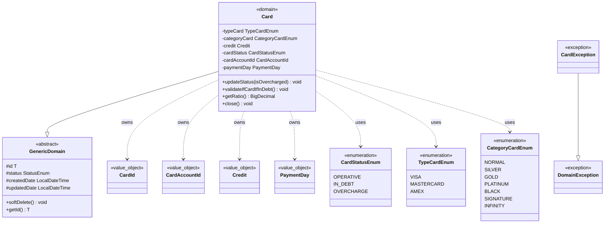

### Agregado Balance

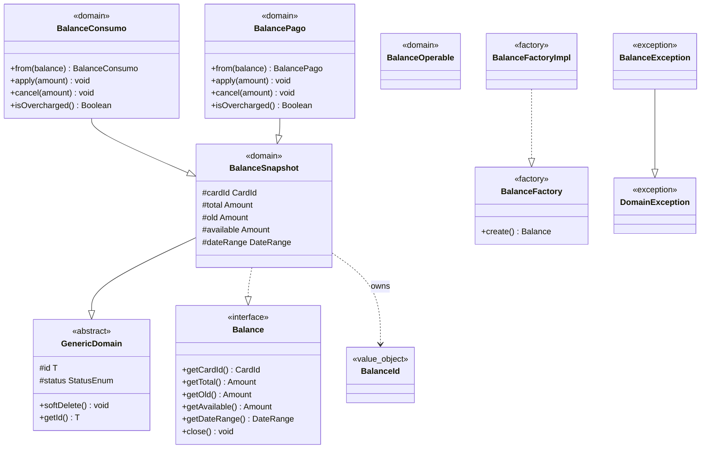

### Agregado Benefit

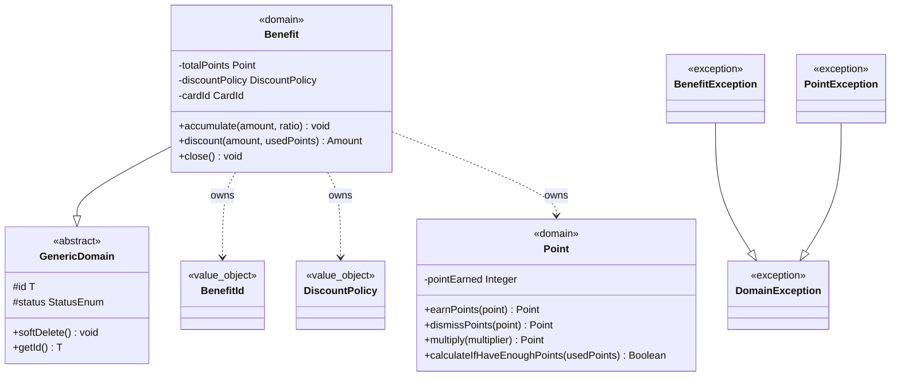

### Agregado Consumption

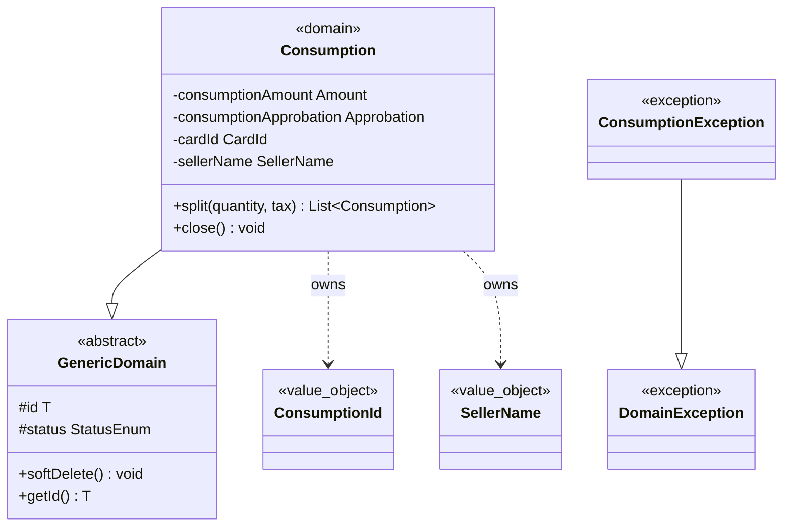

### Agregado Payment

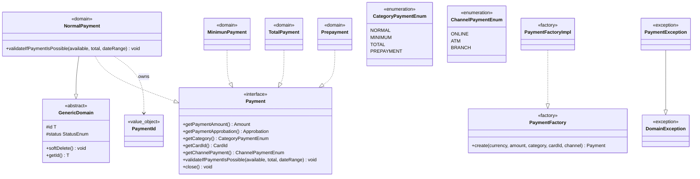

### Base Domain — Value Objects compartidos

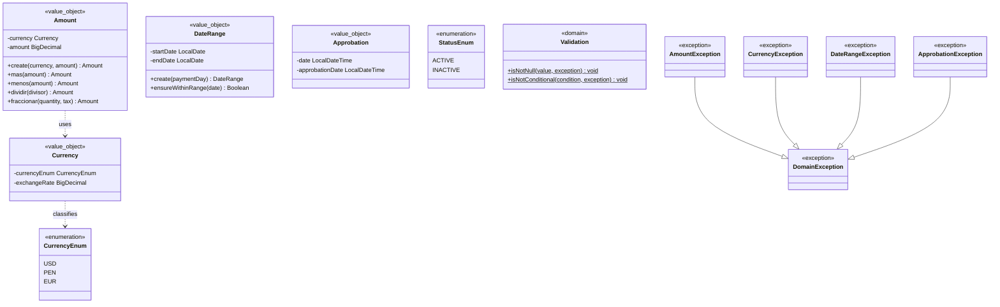

---

## 🗄️ SQL Server Adapters — Outbound

```mermaid
classDiagram
    class CardJpaRepositoryAdapter {
        <<adapter>>
        -cardJpaRepository CardJpaRepository
        -cardVOJpaRepository CardVOJpaRepository
        -cardPersistanceMapper CardPersistanceMapper
        -cardAccountJpaRepository CardAccountJpaRepository
        -cardAccountPersistanceMapper CardAccountPersistanceMapper
        -cardQueryMapper CardQueryMapper
        +load(cardId, currency) Optional~Card~
        +save(card) Optional~Long~
        +loadAll(cardId) Optional~LoadCardBalanceBenefitView~
        +load(cardId) Optional~CurrencyEnum~
    }
    class BalanceJpaRepositoryAdapter {
        <<adapter>>
        -balanceJpaRepository BalanceJpaRepository
        -balanceVOJpaRepository BalanceVOJpaRepository
        -balancePersistenceMapper BalancePersistanceMapper
        +save(balance) Optional~Long~
        +load(cardId, currency) Optional~Balance~
    }
    class BenefitJpaRepositoryAdapter {
        <<adapter>>
        -benefitJpaRepository BenefitJpaRepository
        -benefitVOJpaRepository BenefitVOJpaRepository
        -benefitPersistenceMapper BenefitPersistanceMapper
        +save(benefit) Optional~Long~
        +load(cardId) Optional~Benefit~
    }

    class CardEntity { <<jpa>> }
    class CardAccountEntity { <<jpa>> }
    class BalanceEntity { <<jpa>> }
    class BenefitEntity { <<jpa>> }
    class CardJpaRepository { <<jpa>> }
    class CardAccountJpaRepository { <<jpa>> }
    class CardVOJpaRepository { <<jpa>> }
    class BalanceJpaRepository { <<jpa>> }
    class BalanceVOJpaRepository { <<jpa>> }
    class BenefitJpaRepository { <<jpa>> }
    class BenefitVOJpaRepository { <<jpa>> }

    class CardPersistanceMapper { <<interface>> }
    class CardPersistanceMapperImpl { <<adapter>> }
    class CardAccountPersistanceMapper { <<interface>> }
    class CardAccountPersistanceMapperImpl { <<adapter>> }
    class CardQueryMapper { <<interface>> }
    class CardQueryMapperImpl { <<adapter>> }
    class BalancePersistanceMapper { <<interface>> }
    class BalancePersistanceMapperImpl { <<adapter>> }
    class BenefitPersistanceMapper { <<interface>> }
    class BenefitPersistanceMapperImpl { <<adapter>> }

    class CardStatusEnumConverter { <<adapter>> }
    class CategoryCardEnumConverter { <<adapter>> }
    class TypeCardEnumConverter { <<adapter>> }

    class CardPersistanceException { <<exception>> }
    class BalancePersistanceException { <<exception>> }
    class BenefitPersistanceException { <<exception>> }

    class LoadCardPort { <<port_out>> }
    class SaveCardPort { <<port_out>> }
    class LoadCardBalanceBenefitPort { <<port_out>> }
    class LoadCardCurrencyPort { <<port_out>> }
    class LoadBalancePort { <<port_out>> }
    class SaveBalancePort { <<port_out>> }
    class LoadBenefitPort { <<port_out>> }
    class SaveBenefitPort { <<port_out>> }

    CardJpaRepositoryAdapter ..|> LoadCardPort
    CardJpaRepositoryAdapter ..|> SaveCardPort
    CardJpaRepositoryAdapter ..|> LoadCardBalanceBenefitPort
    CardJpaRepositoryAdapter ..|> LoadCardCurrencyPort
    BalanceJpaRepositoryAdapter ..|> LoadBalancePort
    BalanceJpaRepositoryAdapter ..|> SaveBalancePort
    BenefitJpaRepositoryAdapter ..|> LoadBenefitPort
    BenefitJpaRepositoryAdapter ..|> SaveBenefitPort

    CardJpaRepositoryAdapter --> CardJpaRepository
    CardJpaRepositoryAdapter --> CardVOJpaRepository
    CardJpaRepositoryAdapter --> CardAccountJpaRepository
    CardJpaRepositoryAdapter --> CardPersistanceMapper
    CardJpaRepositoryAdapter --> CardAccountPersistanceMapper
    CardJpaRepositoryAdapter --> CardQueryMapper
    BalanceJpaRepositoryAdapter --> BalanceJpaRepository
    BalanceJpaRepositoryAdapter --> BalanceVOJpaRepository
    BalanceJpaRepositoryAdapter --> BalancePersistanceMapper
    BenefitJpaRepositoryAdapter --> BenefitJpaRepository
    BenefitJpaRepositoryAdapter --> BenefitVOJpaRepository
    BenefitJpaRepositoryAdapter --> BenefitPersistanceMapper

    CardPersistanceMapperImpl ..|> CardPersistanceMapper
    CardAccountPersistanceMapperImpl ..|> CardAccountPersistanceMapper
    CardQueryMapperImpl ..|> CardQueryMapper
    BalancePersistanceMapperImpl ..|> BalancePersistanceMapper
    BenefitPersistanceMapperImpl ..|> BenefitPersistanceMapper
```

---

## 🗃️ NoSQL Adapters — Outbound

### Azure Cosmos DB

```mermaid
classDiagram
    class ConsumptionCosmosRepositoryAdapter {
        <<adapter>>
        -consumptionCosmosRepository ConsumptionCosmosRepository
        -consumptionPersistanceMapperCosmos ConsumptionPersistanceMapperCosmos
        -consumptionQueryMapperCosmos ConsumptionQueryMapperCosmos
        +save(consumption) Optional~UUID~
        +load(consumptionId, cardId, currency) Optional~Consumption~
        +load(criteria) List~LoadConsumptionView~
        +load(consumptionId, cardId) Optional~CurrencyEnum~
    }
    class PaymentCosmosRepositoryAdapter {
        <<adapter>>
        -paymentCosmosRepository PaymentCosmosRepository
        -paymentPersistanceMapperCosmos PaymentPersistanceMapperCosmos
        -paymentQueryMapperCosmos PaymentQueryMapperCosmos
        +save(payment) Optional~UUID~
        +load(paymentId, cardId, currency) Optional~Payment~
        +load(criteria) List~LoadPaymentView~
        +load(paymentId, cardId) Optional~CurrencyEnum~
    }

    class ConsumptionEntityCosmos { <<nosql>> }
    class PaymentEntityCosmos { <<nosql>> }
    class ConsumptionCosmosRepository { <<nosql>> }
    class PaymentCosmosRepository { <<nosql>> }
    class ConsumptionPersistanceMapperCosmos { <<interface>> }
    class ConsumptionPersistanceMapperCosmosImpl { <<adapter>> }
    class ConsumptionQueryMapperCosmos { <<interface>> }
    class ConsumptionQueryMapperCosmosImpl { <<adapter>> }
    class PaymentPersistanceMapperCosmos { <<interface>> }
    class PaymentPersistanceMapperCosmosImpl { <<adapter>> }
    class PaymentQueryMapperCosmos { <<interface>> }
    class PaymentQueryMapperCosmosImpl { <<adapter>> }

    class LoadConsumptionPort { <<port_out>> }
    class SaveConsumptionPort { <<port_out>> }
    class LoadConsumptionsByDatesAndCardIdPort { <<port_out>> }
    class LoadConsumptionCurrencyPort { <<port_out>> }
    class LoadPaymentPort { <<port_out>> }
    class SavePaymentPort { <<port_out>> }
    class LoadPaymentsByDatesAndCardIdPort { <<port_out>> }
    class LoadPaymentCurrencyPort { <<port_out>> }

    ConsumptionCosmosRepositoryAdapter ..|> LoadConsumptionPort
    ConsumptionCosmosRepositoryAdapter ..|> SaveConsumptionPort
    ConsumptionCosmosRepositoryAdapter ..|> LoadConsumptionsByDatesAndCardIdPort
    ConsumptionCosmosRepositoryAdapter ..|> LoadConsumptionCurrencyPort
    PaymentCosmosRepositoryAdapter ..|> LoadPaymentPort
    PaymentCosmosRepositoryAdapter ..|> SavePaymentPort
    PaymentCosmosRepositoryAdapter ..|> LoadPaymentsByDatesAndCardIdPort
    PaymentCosmosRepositoryAdapter ..|> LoadPaymentCurrencyPort

    ConsumptionCosmosRepositoryAdapter --> ConsumptionCosmosRepository
    ConsumptionCosmosRepositoryAdapter --> ConsumptionPersistanceMapperCosmos
    ConsumptionCosmosRepositoryAdapter --> ConsumptionQueryMapperCosmos
    PaymentCosmosRepositoryAdapter --> PaymentCosmosRepository
    PaymentCosmosRepositoryAdapter --> PaymentPersistanceMapperCosmos
    PaymentCosmosRepositoryAdapter --> PaymentQueryMapperCosmos
    ConsumptionPersistanceMapperCosmosImpl ..|> ConsumptionPersistanceMapperCosmos
    ConsumptionQueryMapperCosmosImpl ..|> ConsumptionQueryMapperCosmos
    PaymentPersistanceMapperCosmosImpl ..|> PaymentPersistanceMapperCosmos
    PaymentQueryMapperCosmosImpl ..|> PaymentQueryMapperCosmos
```

### MongoDB

```mermaid
classDiagram
    class ConsumptionMongoRepositoryAdapter {
        <<adapter>>
        -consumptionMongoRepository ConsumptionMongoRepository
        -consumptionPersistanceMapperMongo ConsumptionPersistanceMapperMongo
        -consumptionQueryMapperMongo ConsumptionQueryMapperMongo
        +save(consumption) Optional~UUID~
        +load(consumptionId, cardId, currency) Optional~Consumption~
        +load(criteria) List~LoadConsumptionView~
        +load(consumptionId, cardId) Optional~CurrencyEnum~
    }
    class PaymentMongoRepositoryAdapter {
        <<adapter>>
        -paymentMongoRepository PaymentMongoRepository
        -paymentPersistanceMapperMongo PaymentPersistanceMapperMongo
        -paymentQueryMapperMongo PaymentQueryMapperMongo
        +save(payment) Optional~UUID~
        +load(paymentId, cardId, currency) Optional~Payment~
        +load(criteria) List~LoadPaymentView~
        +load(paymentId, cardId) Optional~CurrencyEnum~
    }

    class ConsumptionEntityMongo { <<nosql>> }
    class PaymentEntityMongo { <<nosql>> }
    class ConsumptionMongoRepository { <<nosql>> }
    class PaymentMongoRepository { <<nosql>> }
    class ConsumptionPersistanceMapperMongo { <<interface>> }
    class ConsumptionPersistanceMapperMongoImpl { <<adapter>> }
    class ConsumptionQueryMapperMongo { <<interface>> }
    class ConsumptionQueryMapperMongoImpl { <<adapter>> }
    class PaymentPersistanceMapperMongo { <<interface>> }
    class PaymentPersistanceMapperMongoImpl { <<adapter>> }
    class PaymentQueryMapperMongo { <<interface>> }
    class PaymentQueryMapperMongoImpl { <<adapter>> }
    class ConsumptionPersistanceException { <<exception>> }
    class PaymentPersistanceException { <<exception>> }

    class LoadConsumptionPortMongo { <<port_out>> }
    class SaveConsumptionPortMongo { <<port_out>> }
    class LoadConsumptionsByDatesPortMongo { <<port_out>> }
    class LoadConsumptionCurrencyPortMongo { <<port_out>> }
    class LoadPaymentPortMongo { <<port_out>> }
    class SavePaymentPortMongo { <<port_out>> }
    class LoadPaymentsByDatesPortMongo { <<port_out>> }
    class LoadPaymentCurrencyPortMongo { <<port_out>> }

    ConsumptionMongoRepositoryAdapter ..|> LoadConsumptionPortMongo
    ConsumptionMongoRepositoryAdapter ..|> SaveConsumptionPortMongo
    ConsumptionMongoRepositoryAdapter ..|> LoadConsumptionsByDatesPortMongo
    ConsumptionMongoRepositoryAdapter ..|> LoadConsumptionCurrencyPortMongo
    PaymentMongoRepositoryAdapter ..|> LoadPaymentPortMongo
    PaymentMongoRepositoryAdapter ..|> SavePaymentPortMongo
    PaymentMongoRepositoryAdapter ..|> LoadPaymentsByDatesPortMongo
    PaymentMongoRepositoryAdapter ..|> LoadPaymentCurrencyPortMongo

    ConsumptionMongoRepositoryAdapter --> ConsumptionMongoRepository
    ConsumptionMongoRepositoryAdapter --> ConsumptionPersistanceMapperMongo
    ConsumptionMongoRepositoryAdapter --> ConsumptionQueryMapperMongo
    PaymentMongoRepositoryAdapter --> PaymentMongoRepository
    PaymentMongoRepositoryAdapter --> PaymentPersistanceMapperMongo
    PaymentMongoRepositoryAdapter --> PaymentQueryMapperMongo
    ConsumptionPersistanceMapperMongoImpl ..|> ConsumptionPersistanceMapperMongo
    ConsumptionQueryMapperMongoImpl ..|> ConsumptionQueryMapperMongo
    PaymentPersistanceMapperMongoImpl ..|> PaymentPersistanceMapperMongo
    PaymentQueryMapperMongoImpl ..|> PaymentQueryMapperMongo
```

---

## 🌍 WS Adapter & ID Generator — Outbound

```mermaid
classDiagram
    class CurrencyWSAdapter {
        <<adapter>>
        -currencyJsonServerWSRepository CurrencyJsonServerWSRepository
        -mapperCurrency MapperCurrency
        +load(currencyEnum) Optional~Currency~
    }
    class CurrencyJsonServerWSRepository {
        <<ws>>
        -restClient RestClient
        +findByCurrency(currency) CurrencyDto
    }
    class CurrencyDto { <<schema>> }
    class MapperCurrency {
        <<interface>>
        +toDomain(dto, currencyEnum) Currency
    }
    class MapperCurrencyImpl { <<adapter>> }
    class RestClientConfig { <<config>> }
    class ConverterWSClientException { <<exception>> }
    class SnowflakeGenerator {
        <<adapter>>
        -machineId long
        -sequence long
        -lastTimestamp long
        +load() Optional~Long~
    }
    class LoadCurrencyPort {
        <<port_out>>
        +load(currencyEnum) Optional~Currency~
    }
    class LoadIdPort {
        <<port_out>>
        +load() Optional~Long~
    }

    CurrencyWSAdapter ..|> LoadCurrencyPort
    CurrencyWSAdapter --> CurrencyJsonServerWSRepository
    CurrencyWSAdapter --> MapperCurrency
    CurrencyJsonServerWSRepository --> CurrencyDto : returns
    MapperCurrencyImpl ..|> MapperCurrency
    SnowflakeGenerator ..|> LoadIdPort
```

---

## ⚙️ Spring Configuration

```mermaid
classDiagram
    namespace ConfigUseCases {
        class CreateCardServiceConfig { <<config>> }
        class ConsumptionServiceConfig { <<config>> }
        class PaymentServiceConfig { <<config>> }
        class CancelConsumptionServiceConfig { <<config>> }
        class CancelPaymentServiceConfig { <<config>> }
        class CardCloseServiceConfig { <<config>> }
        class SplitConsumptionServiceConfig { <<config>> }
        class LoadCardByIdServiceConfig { <<config>> }
        class LoadConsumptionByDatesAndCardIdServiceConfig { <<config>> }
        class LoadPaymentByDatesAndCardIdServiceConfig { <<config>> }
    }
    namespace ConfigBusinessServices {
        class BusinessServiceCardConfig { <<config>> }
        class BusinessServiceBalanceConfig { <<config>> }
        class BusinessServiceBenefitConfig { <<config>> }
        class BusinessServiceConsumptionConfig { <<config>> }
        class BusinessServicePaymentConfig { <<config>> }
    }
    namespace ConfigAdapters {
        class CardManagementAdapterConfig { <<config>> }
        class CardJpaRepositoryAdapterConfig { <<config>> }
        class BalanceJpaRepositoryAdapterConfig { <<config>> }
        class BenefitJpaRepositoryAdapterConfig { <<config>> }
        class ConsumptionMongoRepositoryAdapterConfigMongo { <<config>> }
        class PaymentMongoRepositoryAdapterConfigMongo { <<config>> }
        class ConsumptionCosmosRepositoryAdapterConfigCosmos { <<config>> }
        class PaymentCosmosRepositoryAdapterConfigCosmos { <<config>> }
    }
    namespace ConfigInfrastructure {
        class SnowflakeGeneratorConfig { <<config>> }
        class CurrencyWSAdapterConfig { <<config>> }
        class JpaRepositoryConfig { <<config>> }
        class MongoRepositoryConfig { <<config>> }
        class CosmosRepositoryConfig { <<config>> }
    }
```

---

## 🚨 Jerarquía de Excepciones

```mermaid
classDiagram
    class DomainException { <<exception>> }
    class ApplicationException { <<abstract>> }
    class CardException { <<exception>> }
    class BalanceException { <<exception>> }
    class BenefitException { <<exception>> }
    class PointException { <<exception>> }
    class ConsumptionException { <<exception>> }
    class PaymentException { <<exception>> }
    class AmountException { <<exception>> }
    class CurrencyException { <<exception>> }
    class DateRangeException { <<exception>> }
    class ApprobationException { <<exception>> }
    class ApplicationCardException { <<exception>> }
    class ApplicationBalanceException { <<exception>> }
    class ApplicationBenefitException { <<exception>> }
    class ApplicationConsumptionException { <<exception>> }
    class ApplicationPaymentException { <<exception>> }
    class ApplicationGeneratorException { <<exception>> }
    class CardPersistanceException { <<exception>> }
    class BalancePersistanceException { <<exception>> }
    class BenefitPersistanceException { <<exception>> }
    class ConsumptionPersistanceException { <<exception>> }
    class PaymentPersistanceException { <<exception>> }
    class ConverterWSClientException { <<exception>> }

    CardException --|> DomainException
    BalanceException --|> DomainException
    BenefitException --|> DomainException
    PointException --|> DomainException
    ConsumptionException --|> DomainException
    PaymentException --|> DomainException
    AmountException --|> DomainException
    CurrencyException --|> DomainException
    DateRangeException --|> DomainException
    ApprobationException --|> DomainException
    ApplicationCardException --|> ApplicationException
    ApplicationBalanceException --|> ApplicationException
    ApplicationBenefitException --|> ApplicationException
    ApplicationConsumptionException --|> ApplicationException
    ApplicationPaymentException --|> ApplicationException
    ApplicationGeneratorException --|> ApplicationException
```

---

## 🔗 Relaciones Clave — Flujo Completo

### Controller → Delegate → Use Cases → Ports → Adapters

```mermaid
classDiagram
    class CardManagementApiImpl { <<controller>> }
    class CardManagementDelegate { <<interface>> }
    class CardManagementDelegateImpl { <<delegate>> }
    class TransactionalUseCaseAspect { <<aspect>> }
    class TransactionalUseCase { <<annotation>> }

    class CreateCardService { <<usecase>> }
    class ConsumptionService { <<usecase>> }
    class PaymentService { <<usecase>> }
    class CancelConsumptionService { <<usecase>> }
    class CancelPaymentService { <<usecase>> }
    class CardCloseService { <<usecase>> }
    class SplitConsumptionService { <<usecase>> }
    class LoadCardByIdService { <<query>> }
    class LoadConsumptionByDatesAndCardIdService { <<query>> }
    class LoadPaymentByDatesAndCardIdService { <<query>> }

    class BusinessServiceCardImpl { <<business>> }
    class BusinessServiceBalanceImpl { <<business>> }
    class BusinessServiceBenefitImpl { <<business>> }
    class BusinessServiceConsumptionImpl { <<business>> }
    class BusinessServicePaymentImpl { <<business>> }

    class CardJpaRepositoryAdapter { <<adapter>> }
    class BalanceJpaRepositoryAdapter { <<adapter>> }
    class BenefitJpaRepositoryAdapter { <<adapter>> }
    class ConsumptionCosmosRepositoryAdapter { <<adapter>> }
    class PaymentCosmosRepositoryAdapter { <<adapter>> }
    class ConsumptionMongoRepositoryAdapter { <<adapter>> }
    class PaymentMongoRepositoryAdapter { <<adapter>> }
    class CurrencyWSAdapter { <<adapter>> }
    class SnowflakeGenerator { <<adapter>> }

    CardManagementApiImpl ..|> CardManagementDelegate
    CardManagementApiImpl --> CardManagementDelegateImpl : delegates to
    TransactionalUseCaseAspect --> TransactionalUseCase : intercepts @

    CardManagementDelegateImpl --> CreateCardService
    CardManagementDelegateImpl --> ConsumptionService
    CardManagementDelegateImpl --> PaymentService
    CardManagementDelegateImpl --> CancelConsumptionService
    CardManagementDelegateImpl --> CancelPaymentService
    CardManagementDelegateImpl --> CardCloseService
    CardManagementDelegateImpl --> SplitConsumptionService
    CardManagementDelegateImpl --> LoadCardByIdService
    CardManagementDelegateImpl --> LoadConsumptionByDatesAndCardIdService
    CardManagementDelegateImpl --> LoadPaymentByDatesAndCardIdService

    CreateCardService --> BusinessServiceCardImpl
    CreateCardService --> BusinessServiceBalanceImpl
    CreateCardService --> BusinessServiceBenefitImpl
    ConsumptionService --> BusinessServiceCardImpl
    ConsumptionService --> BusinessServiceBalanceImpl
    ConsumptionService --> BusinessServiceConsumptionImpl
    PaymentService --> BusinessServiceCardImpl
    PaymentService --> BusinessServiceBalanceImpl
    PaymentService --> BusinessServicePaymentImpl
    CancelConsumptionService --> BusinessServiceCardImpl
    CancelConsumptionService --> BusinessServiceBalanceImpl
    CancelConsumptionService --> BusinessServiceConsumptionImpl
    CancelPaymentService --> BusinessServiceCardImpl
    CancelPaymentService --> BusinessServiceBalanceImpl
    CancelPaymentService --> BusinessServicePaymentImpl
    CardCloseService --> BusinessServiceCardImpl
    CardCloseService --> BusinessServiceBalanceImpl
    CardCloseService --> BusinessServiceBenefitImpl
    SplitConsumptionService --> BusinessServiceCardImpl
    SplitConsumptionService --> BusinessServiceBalanceImpl
    SplitConsumptionService --> BusinessServiceConsumptionImpl

    BusinessServiceCardImpl --> CardJpaRepositoryAdapter : LoadCardPort / SaveCardPort
    BusinessServiceBalanceImpl --> BalanceJpaRepositoryAdapter : LoadBalancePort / SaveBalancePort
    BusinessServiceBenefitImpl --> BenefitJpaRepositoryAdapter : LoadBenefitPort / SaveBenefitPort
    BusinessServiceConsumptionImpl --> ConsumptionCosmosRepositoryAdapter : LoadConsumptionPort / SaveConsumptionPort
    BusinessServiceConsumptionImpl --> ConsumptionMongoRepositoryAdapter : LoadConsumptionPort / SaveConsumptionPort
    BusinessServicePaymentImpl --> PaymentCosmosRepositoryAdapter : LoadPaymentPort / SavePaymentPort
    BusinessServicePaymentImpl --> PaymentMongoRepositoryAdapter : LoadPaymentPort / SavePaymentPort
    BusinessServiceCardImpl --> CurrencyWSAdapter : LoadCurrencyPort
    BusinessServiceBalanceImpl --> CurrencyWSAdapter : LoadCurrencyPort
    CreateCardService --> SnowflakeGenerator : LoadIdPort
```

### Diagrama de Secuencia — Crear Tarjeta (flujo completo)

```mermaid
sequenceDiagram
    actor Client as 🌐 HTTP Client
    participant Ctrl as CardManagementApiImpl
    participant Del as CardManagementDelegateImpl
    participant Mapper as CardApiMapperRequestCommandImpl
    participant UC as CreateCardService
    participant BSCard as BusinessServiceCardImpl
    participant BSBal as BusinessServiceBalanceImpl
    participant BSBen as BusinessServiceBenefitImpl
    participant Snowflake as SnowflakeGenerator
    participant Currency as CurrencyWSAdapter
    participant CardRepo as CardJpaRepositoryAdapter
    participant BalRepo as BalanceJpaRepositoryAdapter
    participant BenRepo as BenefitJpaRepositoryAdapter
    participant DB as 🗄️ SQL Server

    Client->>+Ctrl: POST /cards (InitiateCardRequest)
    Ctrl->>+Del: initiateCard(req, br)
    Del->>+Mapper: toCommand(req)
    Mapper-->>-Del: CardCreateCommand
    Del->>+UC: createCard(CardCreateCommand)
    UC->>+Snowflake: load()
    Snowflake-->>-UC: Optional~Long~ cardId
    UC->>+Currency: load(currencyEnum)
    Currency-->>-UC: Optional~Currency~
    UC->>+BSCard: get(cardId)
    BSCard->>+CardRepo: load(cardId, currency)
    CardRepo->>+DB: SELECT card
    DB-->>-CardRepo: CardEntity
    CardRepo-->>-BSCard: Optional~Card~
    BSCard-->>-UC: Card
    UC->>+BSBal: save(balance)
    BSBal->>+BalRepo: save(balance)
    BalRepo->>+DB: INSERT balance
    DB-->>-BalRepo: Long
    BalRepo-->>-BSBal: Optional~Long~
    BSBal-->>-UC: BalanceId
    UC->>+BSBen: save(benefit)
    BSBen->>+BenRepo: save(benefit)
    BenRepo->>+DB: INSERT benefit
    DB-->>-BenRepo: Long
    BenRepo-->>-BSBen: Optional~Long~
    BSBen-->>-UC: BenefitId
    UC->>+BSCard: save(card)
    BSCard->>+CardRepo: save(card)
    CardRepo->>+DB: INSERT card
    DB-->>-CardRepo: Long
    CardRepo-->>-BSCard: Optional~Long~
    BSCard-->>-UC: CardId
    UC-->>-Del: CardId
    Del-->>-Ctrl: ResponseEntity~Long202Response~
    Ctrl-->>-Client: 202 Accepted
```

---

> 📄 Documentación generada desde el código fuente real de `ms-hex-credit-card-gt`  
> 🗓️ Fecha: 2026-06-17  
> 🏗️ Arquitectura: Hexagonal (Ports & Adapters) + DDD  
> ☕ Stack: Java · Spring Boot · JPA · SQL Server · Azure Cosmos DB · MongoDB · Spring RestClient
